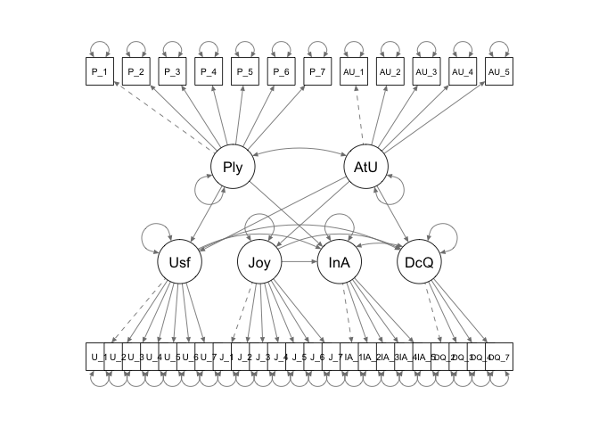

Import the data and set up the packages:
```{r}
df <- read.csv("/Users/caizheny/Downloads/YouTube SEM Series_2017_Cleaned.csv")
library(lavaan)
library(semPlot)
library(dplyr)
library(moments)
library(psych)
library(GPArotation)
```

Data cleaning:


Check the assumptions:

(1)Accuracy
```{r}
str(df)
summary(df)
```

All the items are numerical and ranges from 1-5, which is the right range, the only problem is the Gender variable, it should be a categorical variable instead of a numerical variable.

```{r}
df$Gender <- factor(df$Gender)
levels(df$Gender) <- c("Male", "Female")
```

(2) Missing
```{r}
any(is.na(df))
```
There are no missing values

(3)Outliers
```{r}
cutoff <- qchisq(1-.001, ncol(df))
mahal <- mahalanobis(select(df, Playful_1:DecQual_8), colMeans(select(df, Playful_1:DecQual_8)), cov(select(df, Playful_1:DecQual_8)))
NoMultiOutlier <- subset(df, mahal < cutoff)
Items <- select(NoMultiOutlier, Playful_1:DecQual_8)
nrow(NoMultiOutlier) # 361
nrow(Items)  # 380    19 cases are deleted
```
<!-- -->

Check the multivariate outliers and found that the mahalnobis distance of 19 cases is higher than the cutoff value, so delete those cases.

(3) additivity: check the correlation matrix of the original data, make sure it;s not perfectly correlated.
```{r}
correl <- cor(Items, use = "pairwise.complete.obs")
symnum(correl)
```

No pairs of item are highly correlated.


(4)Linearity Normality Homogeneity  Homoscedasciticity
```{r}
#set up the assumptions
random <- rchisq(nrow(Items), 7)
## run a fake regression, we use all the variables to predict a series of random number
fake <- lm(random~., data = Items)
# Create the standardized residuals and scaled fitted values
standaridzed_residuals <- rstudent(fake)
fitted <- scale(fake$fitted.values)

#check the Normality
any(skewness(Items)>3)
kur <- kurtosis(Items)
a <- subset(Items, kur>3) # super kurtosis
hist(standaridzed_residuals) # looks decent

# Linearity: we use the qqplot
qqnorm(standaridzed_residuals)
abline(a=0,b=1)

#Homogeneity and Homoscedastivity
plot(fitted,standaridzed_residuals)
abline(0,0)
abline(v=0)
abline(h=2)
numberfactors <- fa.parallel(Items, fm = "ml", fa ="fa")
model <- fa(Items, nfactors = 6, rotate = "promax", fm="ml")
model2 <- fa(Items[ ,-c(36)], nfactors = 6, rotate = "promax", fm="ml")
model3 <- fa(Items[ ,-c(36,32,38)], nfactors = 6, rotate = "promax", fm="ml")
```


```{r}
cfi <- 1 - ((model3$STATISTIC - model3$dof)/
              (model3$null.chisq - model3$null.dof))
cfi
```


CFA:

```{r}
Excel_model_cfa <- '
Playful =~ Playful_1 + Playful_2 + Playful_3 + Playful_4 + Playful_5 + Playful_6 + Playful_7
AtypUse =~ AtypUse_1 + AtypUse_2 + AtypUse_3 + AtypUse_4 + AtypUse_5
Useful =~ Useful_1 + Useful_2 + Useful_3 + Useful_4 + Useful_5 + Useful_6 + Useful_7
Joy =~ Joy_1 + Joy_2 + Joy_3 + Joy_4 + Joy_5 + Joy_6 + Joy_7
InfoAcq =~ InfoAcq_1 + InfoAcq_2 + InfoAcq_3 + InfoAcq_4 + InfoAcq_5
DecQual =~ DecQual_2 + DecQual_3 + DecQual_4 + DecQual_7
'
cfa_path <- cfa(Excel_model_cfa, data = Items)
summary(cfa_path, 
        standardized=TRUE, 
        rsquare=TRUE, 
        fit.measure = TRUE)
semPaths(cfa_path)
```

Strutrual Model:
```{r}
Excel_model_path <- '
# measurement model
Playful =~ Playful_1 + Playful_2 + Playful_3 + Playful_4 + Playful_5 + Playful_6 + Playful_7
AtypUse =~ AtypUse_1 + AtypUse_2 + AtypUse_3 + AtypUse_4 + AtypUse_5
Useful =~ Useful_1 + Useful_2 + Useful_3 + Useful_4 + Useful_5 + Useful_6 + Useful_7
Joy =~ Joy_1 + Joy_2 + Joy_3 + Joy_4 + Joy_5 + Joy_6 + Joy_7
InfoAcq =~ InfoAcq_1 + InfoAcq_2 + InfoAcq_3 + InfoAcq_4 + InfoAcq_5
DecQual =~ DecQual_2 + DecQual_3 + DecQual_4 + DecQual_7

# regression
Useful ~ Playful + AtypUse
Joy ~ AtypUse
DecQual ~ Useful + AtypUse + Joy
InfoAcq ~ Useful + Playful + Joy
'
PathModel_1 <- sem(Excel_model_path, data = Items)
summary(PathModel_1, 
        standardized=TRUE, 
        rsquare=TRUE, 
        fit.measure = TRUE)
semPaths(PathModel_1, layout = "tree")
```

Multiple group:
# for cfa model
```{r}
#Subset the data and test the model fit within each data
items_men <- filter(NoMultiOutlier, Gender == "Male")
items_women <- filter(NoMultiOutlier, Gender == "Female")
men_fit <- cfa(Excel_model_cfa, data = items_men, meanstructure=TRUE)
women_fit <- cfa(Excel_model_cfa, data = items_women, meanstructure=TRUE)
summary(men_fit, fit.measures=T)
summary(women_fit, fit.measures=T)

# Test
library(semTools)
options(scipen = 999)
multisteps <- measurementInvariance(Excel_model_cfa, 
                                   data = NoMultiOutlier, 
                                   group = "Gender",
                                   strict = T )

```


